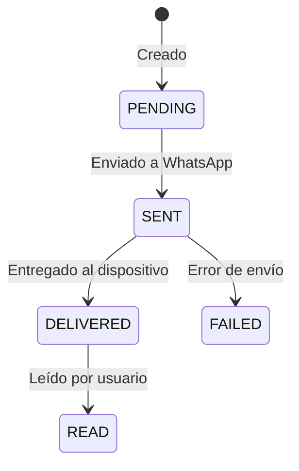

## Listar Mensajes

```
GET /api/conversations/{id}/messages/
```

### Parámetros de Query

| Parámetro | Tipo | Descripción |
|-----------|------|-------------|
| `page` | integer | Número de página |
| `page_size` | integer | Mensajes por página (default: 50) |
| `before` | datetime | Mensajes antes de esta fecha |
| `after` | datetime | Mensajes después de esta fecha |

### Respuesta

```json
{
  "count": 45,
  "next": null,
  "previous": null,
  "results": [
    {
      "id": 100,
      "message_type": "INCOMING",
      "content_type": "TEXT",
      "content": "Hola, quiero información",
      "whatsapp_message_id": "wamid.xxx123",
      "status": "DELIVERED",
      "timestamp": "2024-01-15T10:25:00Z",
      "created_at": "2024-01-15T10:25:01Z"
    },
    {
      "id": 101,
      "message_type": "OUTGOING",
      "content_type": "TEXT",
      "content": "¡Hola! Con gusto te ayudo.",
      "whatsapp_message_id": "wamid.xxx124",
      "status": "READ",
      "timestamp": "2024-01-15T10:26:00Z",
      "sent_by": {
        "id": 1,
        "name": "María García"
      },
      "created_at": "2024-01-15T10:26:01Z"
    },
    {
      "id": 102,
      "message_type": "INCOMING",
      "content_type": "IMAGE",
      "content": null,
      "media_url": "https://storage.example.com/images/abc123.jpg",
      "media_mime_type": "image/jpeg",
      "whatsapp_message_id": "wamid.xxx125",
      "status": "DELIVERED",
      "timestamp": "2024-01-15T10:28:00Z"
    }
  ]
}
```

---

## Enviar Mensaje

```
POST /api/conversations/{id}/messages/
```

### Body (Texto)

```json
{
  "content_type": "TEXT",
  "content": "Gracias por contactarnos"
}
```

### Body (Template)

```json
{
  "content_type": "TEMPLATE",
  "template_name": "order_confirmation",
  "template_language": "es",
  "template_variables": {
    "1": "Juan",
    "2": "ORD-12345"
  }
}
```

### Body (Imagen)

```json
{
  "content_type": "IMAGE",
  "media_url": "https://example.com/image.jpg",
  "caption": "Aquí está tu recibo"
}
```

### Respuesta

```json
{
  "id": 103,
  "message_type": "OUTGOING",
  "content_type": "TEXT",
  "content": "Gracias por contactarnos",
  "whatsapp_message_id": "wamid.xxx126",
  "status": "SENT",
  "timestamp": "2024-01-15T10:30:00Z",
  "created_at": "2024-01-15T10:30:01Z"
}
```

---

## Tipos de Contenido

| Tipo | Descripción |
|------|-------------|
| `TEXT` | Mensaje de texto simple |
| `IMAGE` | Imagen con caption opcional |
| `VIDEO` | Video con caption opcional |
| `AUDIO` | Mensaje de audio |
| `DOCUMENT` | Documento (PDF, etc.) |
| `TEMPLATE` | Template de WhatsApp |
| `LOCATION` | Ubicación geográfica |
| `STICKER` | Sticker |

---

## Status de Mensaje



| Status | Descripción |
|--------|-------------|
| `PENDING` | Mensaje creado, pendiente de envío |
| `SENT` | Enviado a servidores de WhatsApp |
| `DELIVERED` | Entregado al dispositivo del usuario |
| `READ` | Leído por el usuario |
| `FAILED` | Error en el envío |

---

## Ejemplo Completo

<CodeGroup>

```python Python
import requests

BASE_URL = "https://app.convey.pro/api"
HEADERS = {"Authorization": "Token your-token-here"}

# Obtener mensajes
messages = requests.get(
    f"{BASE_URL}/conversations/1/messages/",
    headers=HEADERS
).json()

for msg in messages["results"]:
    direction = "→" if msg["message_type"] == "OUTGOING" else "←"
    print(f"{direction} [{msg['content_type']}] {msg['content']}")

# Enviar mensaje
new_message = requests.post(
    f"{BASE_URL}/conversations/1/messages/",
    headers=HEADERS,
    json={
        "content_type": "TEXT",
        "content": "¡Gracias por tu mensaje!"
    }
).json()

print(f"Mensaje enviado: {new_message['id']}")
```

```javascript JavaScript
const BASE_URL = "https://app.convey.pro/api";
const HEADERS = { "Authorization": "Token your-token-here" };

// Obtener mensajes
const messagesRes = await fetch(
  `${BASE_URL}/conversations/1/messages/`,
  { headers: HEADERS }
);
const messages = await messagesRes.json();

// Enviar mensaje
const sendRes = await fetch(
  `${BASE_URL}/conversations/1/messages/`,
  {
    method: "POST",
    headers: { ...HEADERS, "Content-Type": "application/json" },
    body: JSON.stringify({
      content_type: "TEXT",
      content: "¡Gracias por tu mensaje!"
    })
  }
);
const newMessage = await sendRes.json();
```

</CodeGroup>

## Errores

| Código | Descripción |
|--------|-------------|
| 400 | Datos inválidos (content_type requerido, etc.) |
| 401 | Token no proporcionado o inválido |
| 403 | Sin permisos para esta conversación |
| 404 | Conversación no encontrada |
| 429 | Rate limit excedido |
