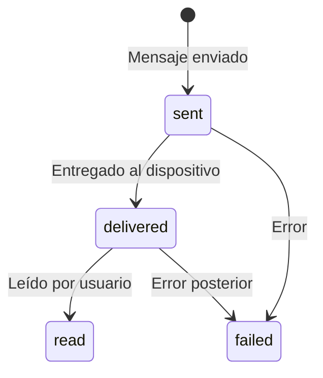

## Endpoint

```
POST /api/webhook/
GET /api/webhook/  (para verificación)
```

## Verificación del Webhook

Meta requiere verificar el webhook antes de enviar eventos.

### Request de Verificación

```
GET /api/webhook/?hub.mode=subscribe&hub.verify_token=YOUR_TOKEN&hub.challenge=CHALLENGE_STRING
```

### Respuesta Esperada

Devolver el valor de `hub.challenge` con status 200.

```
HTTP 200
CHALLENGE_STRING
```

---

## Eventos Soportados

### 1. Mensaje Entrante

```json
{
  "object": "whatsapp_business_account",
  "entry": [{
    "id": "WABA_ID",
    "changes": [{
      "value": {
        "messaging_product": "whatsapp",
        "metadata": {
          "display_phone_number": "15551234567",
          "phone_number_id": "PHONE_NUMBER_ID"
        },
        "contacts": [{
          "profile": {"name": "Juan Pérez"},
          "wa_id": "521234567890"
        }],
        "messages": [{
          "id": "wamid.HBgLNTIxMjM0NTY3ODkwFQIAERgSM...",
          "from": "521234567890",
          "timestamp": "1704067200",
          "type": "text",
          "text": {"body": "Hola!"}
        }]
      },
      "field": "messages"
    }]
  }]
}
```

### 2. Status Update

```json
{
  "object": "whatsapp_business_account",
  "entry": [{
    "id": "WABA_ID",
    "changes": [{
      "value": {
        "messaging_product": "whatsapp",
        "metadata": {
          "display_phone_number": "15551234567",
          "phone_number_id": "PHONE_NUMBER_ID"
        },
        "statuses": [{
          "id": "wamid.HBgLNTIxMjM0NTY3ODkwFQIAERgSM...",
          "status": "delivered",
          "timestamp": "1704067260",
          "recipient_id": "521234567890"
        }]
      },
      "field": "messages"
    }]
  }]
}
```

### 3. Status con Error

```json
{
  "statuses": [{
    "id": "wamid.xxx",
    "status": "failed",
    "timestamp": "1704067260",
    "recipient_id": "521234567890",
    "errors": [{
      "code": 131049,
      "title": "Message not delivered",
      "message": "Spam protection triggered",
      "error_data": {
        "details": "Message failed to send due to spam protection"
      }
    }]
  }]
}
```

---

## Tipos de Mensaje

| Tipo | Descripción | Campos adicionales |
|------|-------------|-------------------|
| `text` | Texto simple | `text.body` |
| `image` | Imagen | `image.id`, `image.mime_type` |
| `video` | Video | `video.id`, `video.mime_type` |
| `audio` | Audio/Nota de voz | `audio.id`, `audio.voice` |
| `document` | Documento | `document.id`, `document.filename` |
| `location` | Ubicación | `location.latitude`, `location.longitude` |
| `sticker` | Sticker | `sticker.id` |
| `button` | Respuesta de botón | `button.text`, `button.payload` |
| `interactive` | Respuesta de lista | `interactive.type`, `interactive.list_reply` |

---

## Flujo de Status



---

## Códigos de Error Comunes

| Código | Título | Descripción |
|--------|--------|-------------|
| 131049 | Spam Protection | Mensaje bloqueado por protección de spam |
| 131047 | Re-engagement Required | Usuario no ha respondido en 24h |
| 131026 | Message Undeliverable | Número inválido o bloqueado |
| 131051 | Unsupported Message Type | Tipo de mensaje no soportado |
| 130472 | User Blocked | Usuario bloqueó el número |
| 131053 | Media Download Failed | Error descargando media |

---

## Seguridad

### Validación de Firma

Todos los webhooks incluyen firma HMAC-SHA256:

```python
import hmac
import hashlib

def validate_signature(request) -> bool:
    signature = request.headers.get("X-Hub-Signature-256")
    if not signature:
        return False

    expected = hmac.new(
        settings.WHATSAPP_APP_SECRET.encode(),
        request.body,
        hashlib.sha256,
    ).hexdigest()

    return hmac.compare_digest(f"sha256={expected}", signature)
```

### Respuesta Requerida

Siempre responder con HTTP 200 dentro de 20 segundos:

```python
@csrf_exempt
def webhook_view(request):
    if request.method == "GET":
        return verify_webhook(request)

    # Validar firma
    if not validate_signature(request):
        return HttpResponse(status=403)

    # Procesar async para responder rápido
    data = json.loads(request.body)
    process_webhook.delay(data)

    return HttpResponse(status=200)
```

---

## Configuración en Meta

1. Ir a [Meta for Developers](https://developers.facebook.com/)
2. Seleccionar tu app
3. WhatsApp → Configuration
4. Configurar Webhook URL: `https://app.convey.pro/api/webhook/`
5. Verificar token: El mismo que `WHATSAPP_VERIFY_TOKEN`
6. Suscribirse a: `messages`

---

## Testing

### Simular Webhook Localmente

```bash
# Mensaje de texto
curl -X POST http://localhost:8000/api/webhook/ \
  -H "Content-Type: application/json" \
  -d '{
    "object": "whatsapp_business_account",
    "entry": [{
      "id": "123456789",
      "changes": [{
        "value": {
          "messaging_product": "whatsapp",
          "metadata": {
            "phone_number_id": "YOUR_PHONE_NUMBER_ID"
          },
          "messages": [{
            "id": "wamid.test123",
            "from": "521234567890",
            "timestamp": "1704067200",
            "type": "text",
            "text": {"body": "Mensaje de prueba"}
          }]
        },
        "field": "messages"
      }]
    }]
  }'
```

### Verificar Status History

```python
# Django shell
from convey.conversations.models import MessageStatusHistory

# Últimos webhooks recibidos
for h in MessageStatusHistory.objects.order_by('-created')[:10]:
    print(f"{h.message_id}: {h.status} @ {h.timestamp}")
```
