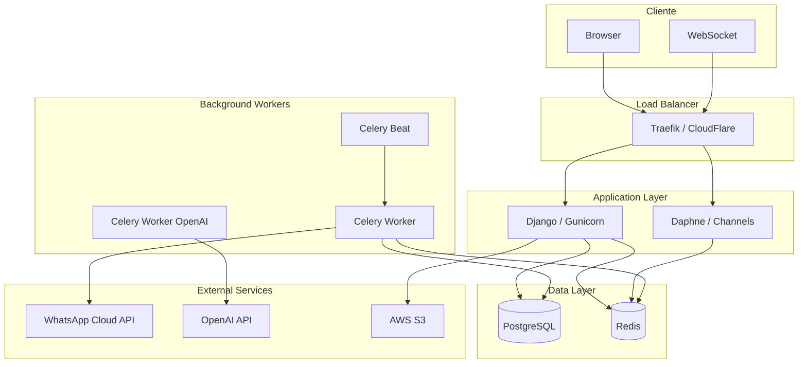
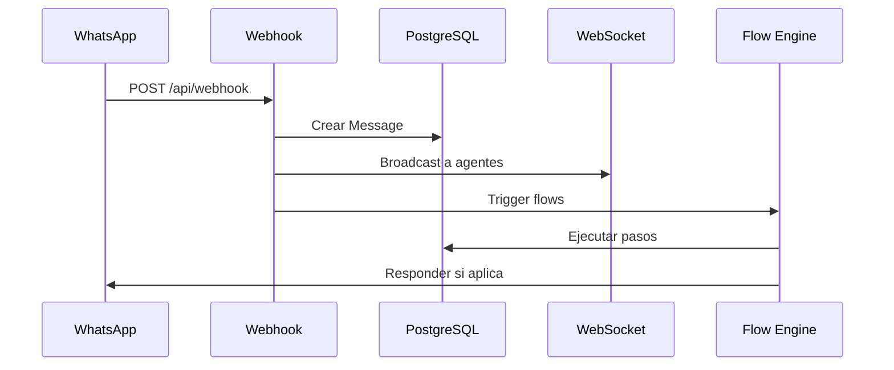
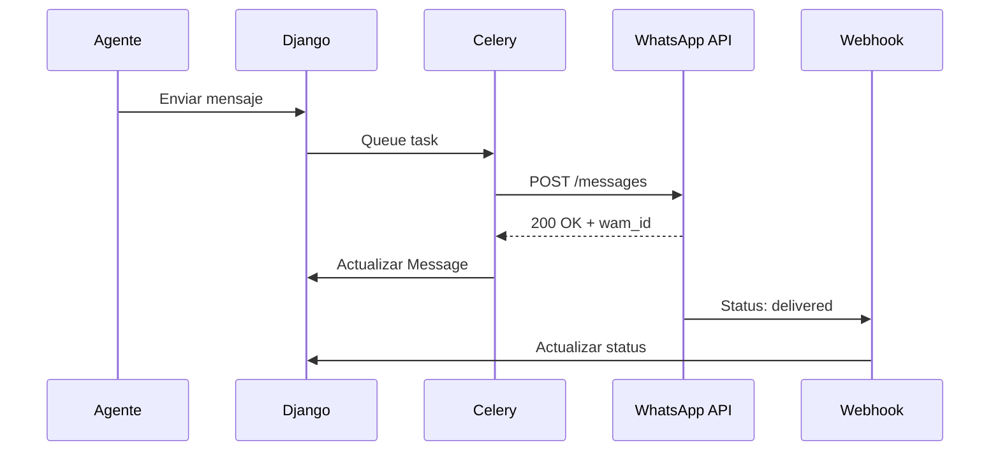

## Estructura del Proyecto

```
conveypro/
├── config/                 # Configuración Django
│   ├── settings/          # Settings por ambiente
│   │   ├── base.py       # Configuración compartida
│   │   ├── local.py      # Desarrollo
│   │   ├── production.py # Producción
│   │   └── test.py       # Testing
│   ├── urls.py            # URLs principales
│   ├── celery_app.py      # Configuración Celery
│   ├── routing.py         # WebSocket routing
│   └── api_router.py      # DRF router
├── convey/                 # Apps principales
│   ├── users/             # Usuarios y Agentes
│   ├── conversations/     # Chat y Flujos
│   ├── messaging/         # Campañas y Templates
│   ├── utils/             # Utilidades compartidas
│   └── templates/         # Templates HTML
├── infra/                  # Kubernetes manifests
├── compose/                # Docker configs
├── requirements/           # Dependencias Python
└── local.yml              # Docker compose dev
```

## Diagrama de Arquitectura



## Apps de Django

<CardGroup cols={3}>
  <Card title="users" icon="users">
    **Modelos:** User, Agent

    Autenticación, perfiles de agentes, asignación de líneas
  </Card>
  <Card title="conversations" icon="comments">
    **Modelos:** Contact, Conversation, Message, Flow, FlowStep...

    Chat en tiempo real, flujos automatizados, webhooks
  </Card>
  <Card title="messaging" icon="paper-plane">
    **Modelos:** MessageTemplate, OutboundCampaign, QueuedMessage...

    Campañas masivas, templates HSM, cola de mensajes
  </Card>
</CardGroup>

## Flujo de Datos

### Mensaje Entrante (WhatsApp → Sistema)



### Mensaje Saliente (Sistema → WhatsApp)



## Stack Tecnológico

| Capa | Tecnología | Propósito |
|------|------------|-----------|
| **Web Framework** | Django 5.1 | Aplicación principal |
| **API** | Django REST Framework | Endpoints REST |
| **Real-time** | Django Channels | WebSocket |
| **Task Queue** | Celery 5.5 | Background jobs |
| **Scheduler** | Celery Beat | Tareas periódicas |
| **Database** | PostgreSQL 15 | Persistencia |
| **Cache/Broker** | Redis 6 | Cache, sessions, queue |
| **Web Server** | Gunicorn + Uvicorn | WSGI/ASGI |
| **Reverse Proxy** | Traefik | Load balancing, SSL |
| **Container** | Docker | Containerización |
| **Orchestration** | Kubernetes | Deploy producción |

## Patrones de Diseño

### 1. Service Layer

Lógica de negocio encapsulada en servicios:

```python
# convey/conversations/services/flow_engine.py
class FlowEngine:
    def execute_step(self, execution, step):
        # Lógica de ejecución de pasos
        pass

    def evaluate_transitions(self, step, context):
        # Evaluar condiciones de transición
        pass
```

### 2. Task Queue Pattern

Operaciones largas en background:

```python
# convey/messaging/tasks.py
@shared_task
def send_campaign_message(queued_message_id: int):
    # Enviar mensaje individual
    pass
```

### 3. Event-Driven

Webhooks disparan acciones:

```python
# Webhook recibido → Celery task → Actualizar DB → Broadcast WebSocket
```

### 4. State Machine

Estados definidos para entidades:

```python
class Conversation:
    class Status(TextChoices):
        UNASSIGNED = "UNASSIGNED"
        IN_FLOW = "IN_FLOW"
        WAITING_FOR_AGENT = "WAITING_FOR_AGENT"
        WITH_AGENT = "WITH_AGENT"
        RESOLVED = "RESOLVED"
```

## Configuración por Ambiente

<Tabs>
  <Tab title="Local">
    ```python
    # config/settings/local.py
    DEBUG = True
    DATABASES = {
        "default": {
            "ENGINE": "django.db.backends.postgresql",
            "HOST": "postgres",
            "PORT": 5432,
        }
    }
    ```
  </Tab>
  <Tab title="Production">
    ```python
    # config/settings/production.py
    DEBUG = False
    SECURE_SSL_REDIRECT = True
    DATABASES = {
        "default": {
            "ENGINE": "django.db.backends.postgresql",
            "HOST": env("DATABASE_HOST"),
            "OPTIONS": {"sslmode": "require"},
        }
    }
    ```
  </Tab>
</Tabs>
