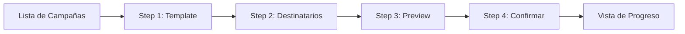

## Resumen

El sistema de campañas permite enviar mensajes masivos a través de WhatsApp usando templates HSM aprobados por Meta.

<CardGroup cols={2}>
  <Card title="Wizard de 4 Pasos" icon="wand-magic-sparkles">
    Creación guiada de campañas
  </Card>
  <Card title="Carga de Excel" icon="file-excel">
    Importar destinatarios con variables
  </Card>
  <Card title="Rate Limiting" icon="gauge">
    Control de velocidad de envío
  </Card>
  <Card title="Tracking Real-time" icon="chart-line">
    Estadísticas en tiempo real
  </Card>
</CardGroup>

## Flujo de Usuario



## URLs

| URL | Descripción |
|-----|-------------|
| `/messaging/campaigns/` | Lista de campañas |
| `/messaging/campaigns/<id>/` | Detalle con tabs |
| `/messaging/campaigns/create/` | Wizard paso 1 |
| `/messaging/campaigns/create/step2/` | Wizard paso 2 |
| `/messaging/campaigns/create/step3/` | Wizard paso 3 |
| `/messaging/campaigns/create/step4/` | Wizard paso 4 |
| `/messaging/messages/<id>/` | Detalle de mensaje |

## Estados de Campaña

<Steps>
  <Step title="DRAFT">
    Campaña creada pero no lanzada
  </Step>
  <Step title="SCHEDULED">
    Programada para envío futuro
  </Step>
  <Step title="RUNNING">
    En proceso de envío
  </Step>
  <Step title="PAUSED">
    Pausada manualmente
  </Step>
  <Step title="COMPLETED">
    Todos los mensajes procesados
  </Step>
  <Step title="CANCELLED">
    Cancelada manualmente
  </Step>
</Steps>

## Estados de Mensaje

| Status | Delivery Status | Descripción |
|--------|-----------------|-------------|
| `PENDING` | - | En cola |
| `PROCESSING` | - | Enviando |
| `SENT` | `SENT` | Enviado a WhatsApp |
| `SENT` | `DELIVERED` | Entregado al dispositivo |
| `SENT` | `READ` | Leído por usuario |
| `FAILED` | `FAILED` | Error en envío/entrega |

## Rate Limiting

El sistema soporta rate limiting configurable:

```python
# Default: 60 mensajes por minuto
messages_per_minute = 60

# Cálculo de delay entre mensajes
delay_seconds = 60.0 / messages_per_minute  # 1 segundo

# Cada mensaje se programa con countdown incremental
for index, recipient in enumerate(recipients):
    send_campaign_message.apply_async(
        args=[queued_message.id],
        countdown=index * delay_seconds,
    )
```

<Info>
Un rate limit de 60 msg/min significa que una campaña de 1000 destinatarios tardará ~17 minutos en completarse.
</Info>

## Próximos Pasos

<CardGroup cols={2}>
  <Card title="Wizard" icon="wand-magic-sparkles" href="/campaigns/wizard">
    Crear una campaña paso a paso
  </Card>
  <Card title="Excel Upload" icon="file-excel" href="/campaigns/excel-upload">
    Formato y carga de archivos
  </Card>
  <Card title="Processing" icon="gears" href="/campaigns/processing">
    Tasks de Celery
  </Card>
</CardGroup>
