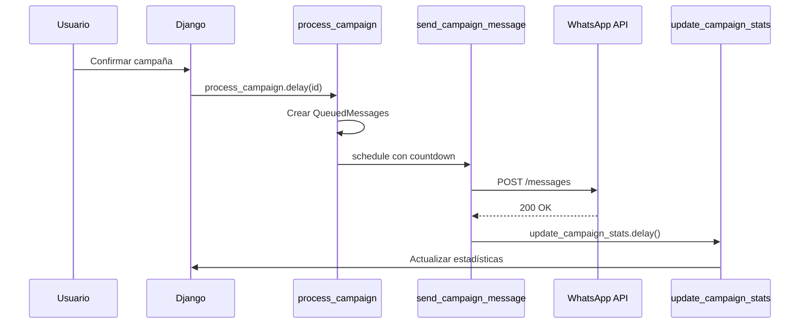

## Arquitectura de Tasks



## Tasks Principales

### process_campaign

Procesa una campaña creando QueuedMessages para cada recipient.

```python
@shared_task(
    name="process_campaign",
    bind=True,
    max_retries=3,
    default_retry_delay=60,
)
def process_campaign(self, campaign_id: int) -> dict:
    campaign = OutboundCampaign.objects.get(id=campaign_id)

    # 1. Actualizar status a RUNNING
    campaign.status = OutboundCampaign.Status.RUNNING
    campaign.started_at = timezone.now()
    campaign.save()

    # 2. Procesar recipients
    recipients = campaign.recipients.filter(status="PENDING")
    delay_seconds = 60.0 / campaign.messages_per_minute

    for index, recipient in enumerate(recipients):
        # Crear QueuedMessage
        queued_message = QueuedMessage.objects.create(
            contact=recipient.contact,
            whatsapp_line=campaign.whatsapp_line,
            template=campaign.template,
            template_variables=recipient.template_variables,
            campaign=campaign,
        )

        # Vincular y programar
        recipient.queued_message = queued_message
        recipient.status = "QUEUED"
        recipient.save()

        # 3. Programar envío con rate limiting
        send_campaign_message.apply_async(
            args=[queued_message.id],
            countdown=index * delay_seconds,
        )

    return {"processed": recipients.count()}
```

---

### send_campaign_message

Envía un mensaje individual de campaña.

```python
@shared_task(
    name="send_campaign_message",
    bind=True,
    max_retries=3,
    default_retry_delay=30,
    autoretry_for=(Exception,),
)
def send_campaign_message(self, queued_message_id: int) -> dict:
    queued_message = QueuedMessage.objects.get(id=queued_message_id)

    # Verificar status de campaña
    if queued_message.campaign.status == "PAUSED":
        return {"status": "paused"}
    if queued_message.campaign.status == "CANCELLED":
        queued_message.status = "CANCELLED"
        queued_message.save()
        return {"status": "cancelled"}

    # Marcar como procesando
    queued_message.mark_processing()

    # Construir payload
    api_request = build_template_payload(
        queued_message.template,
        queued_message.template_variables,
        queued_message.contact.phone_number,
    )
    queued_message.api_request = api_request
    queued_message.save()

    # Enviar a WhatsApp
    response = requests.post(
        f"https://graph.facebook.com/v23.0/{phone_number_id}/messages",
        headers={"Authorization": f"Bearer {access_token}"},
        json=api_request,
    )

    # Guardar response
    queued_message.api_response = {
        "status_code": response.status_code,
        "body": response.json(),
    }
    queued_message.save()

    if response.status_code != 200:
        raise Exception(f"WhatsApp API error: {response.json()}")

    # Éxito
    wam_id = response.json()["messages"][0]["id"]
    queued_message.status = "SENT"
    queued_message.whatsapp_message_id = wam_id
    queued_message.sent_at = timezone.now()
    queued_message.save()

    # Crear Message en conversations
    message = Message.objects.create(
        conversation=conversation,
        message_type="OUTGOING",
        content=rendered_content,
        whatsapp_message_id=wam_id,
        status="SENT",
    )

    # Vincular Message a QueuedMessage
    queued_message.message = message
    queued_message.save()

    # Actualizar stats
    update_campaign_stats.delay(queued_message.campaign.id)

    return {"status": "sent", "wam_id": wam_id}
```

---

### update_campaign_stats

Actualiza estadísticas de la campaña.

```python
@shared_task(name="update_campaign_stats")
def update_campaign_stats(campaign_id: int) -> dict:
    campaign = OutboundCampaign.objects.get(id=campaign_id)

    # Agregar estadísticas
    stats = campaign.queued_messages.aggregate(
        total=Count("id"),
        sent=Count("id", filter=Q(status="SENT")),
        failed=Count("id", filter=Q(status="FAILED")),
        delivered=Count("id", filter=Q(delivery_status="DELIVERED")),
        read=Count("id", filter=Q(delivery_status="READ")),
        actual_cost=Sum("actual_cost"),
    )

    # Actualizar campaña
    campaign.messages_sent = stats["sent"] or 0
    campaign.messages_failed = stats["failed"] or 0
    campaign.messages_delivered = stats["delivered"] or 0
    campaign.messages_read = stats["read"] or 0
    campaign.actual_cost = stats["actual_cost"] or Decimal("0")

    # Verificar si completó
    pending = campaign.queued_messages.filter(
        status__in=["PENDING", "PROCESSING", "SCHEDULED"]
    ).count()

    if pending == 0 and campaign.status == "RUNNING":
        campaign.status = "COMPLETED"
        campaign.completed_at = timezone.now()

    campaign.save()
    return stats
```

---

## Control de Campañas

### Pausar

```python
@shared_task(name="pause_campaign")
def pause_campaign(campaign_id: int):
    campaign = OutboundCampaign.objects.get(id=campaign_id)
    campaign.status = "PAUSED"
    campaign.save()
```

### Reanudar

```python
@shared_task(name="resume_campaign")
def resume_campaign(campaign_id: int):
    campaign = OutboundCampaign.objects.get(id=campaign_id)
    campaign.status = "RUNNING"
    campaign.save()

    # Re-encolar mensajes pendientes
    pending = campaign.queued_messages.filter(status="PENDING")
    delay = 60.0 / campaign.messages_per_minute

    for i, qm in enumerate(pending):
        send_campaign_message.apply_async(
            args=[qm.id],
            countdown=i * delay,
        )
```

### Cancelar

```python
@shared_task(name="cancel_campaign")
def cancel_campaign(campaign_id: int):
    campaign = OutboundCampaign.objects.get(id=campaign_id)

    # Cancelar mensajes pendientes
    campaign.queued_messages.filter(
        status__in=["PENDING", "SCHEDULED"]
    ).update(status="CANCELLED")

    campaign.status = "CANCELLED"
    campaign.completed_at = timezone.now()
    campaign.save()
```

---

## Monitoring

### Flower

Acceder a http://localhost:5555 para monitorear:

- Tasks activas
- Tasks completadas/fallidas
- Workers disponibles
- Rate de procesamiento

### Logs

```bash
# Ver logs de Celery
docker-compose -f local.yml logs -f celeryworker

# Filtrar por campaña
docker-compose -f local.yml logs -f celeryworker | grep "campaign"
```
