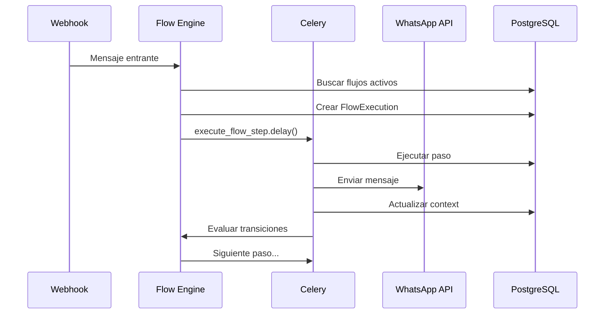
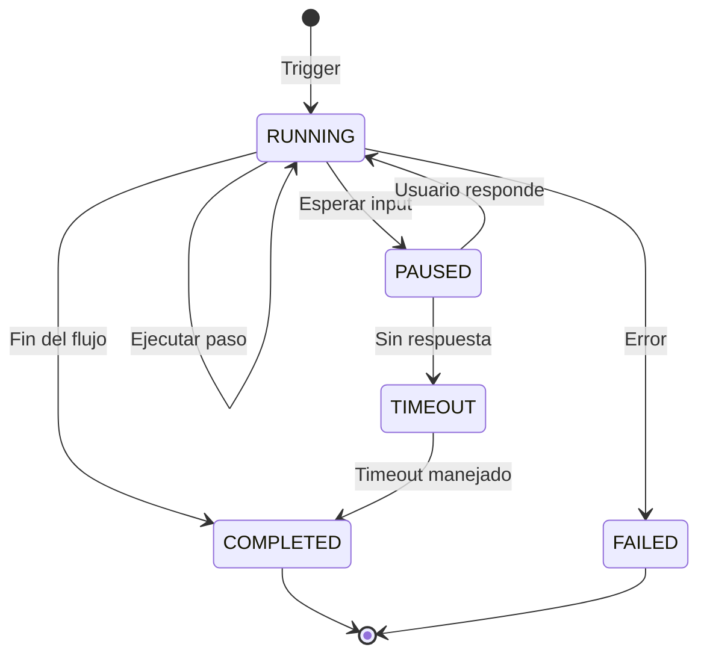

## Arquitectura



## Ciclo de Vida



## Trigger de Flujos

```python
# convey/conversations/services/flow_engine.py

def trigger_flows_for_message(message: Message):
    """Evalúa qué flujo debe ejecutarse para un mensaje."""
    conversation = message.conversation
    line = conversation.whatsapp_line

    # Buscar flujos activos ordenados por prioridad
    flows = Flow.objects.filter(
        whatsapp_lines=line,
        is_active=True,
    ).order_by('-priority')

    for flow in flows:
        if matches_trigger(flow, message):
            # Crear ejecución
            execution = FlowExecution.objects.create(
                flow=flow,
                conversation=conversation,
                status=FlowExecution.Status.RUNNING,
                triggered_by_message=message,
                context={"last_input": message.content},
            )

            # Iniciar ejecución
            entry_step = flow.steps.get(is_entry_point=True)
            execute_flow_step.delay(execution.id, entry_step.id)
            return execution

    return None
```

---

## Ejecución de Pasos

```python
@shared_task(name="execute_flow_step")
def execute_flow_step(execution_id: int, step_id: int):
    execution = FlowExecution.objects.get(id=execution_id)
    step = FlowStep.objects.get(id=step_id)

    # Actualizar paso actual
    execution.current_step = step
    execution.save()

    # Ejecutar según tipo
    handler = get_step_handler(step.step_type)
    result = handler.execute(step, execution)

    # Actualizar contexto
    if result.get("variables"):
        execution.context.update(result["variables"])
        execution.save()

    # Evaluar siguiente paso
    if result.get("wait_for_input"):
        execution.status = FlowExecution.Status.PAUSED
        execution.save()
        return

    next_step = evaluate_transitions(step, execution.context)

    if next_step:
        execute_flow_step.delay(execution.id, next_step.id)
    else:
        execution.status = FlowExecution.Status.COMPLETED
        execution.save()
```

---

## Handlers por Tipo

### SendMessageHandler

```python
class SendMessageHandler:
    def execute(self, step, execution):
        config = step.configuration
        message = render_template(config["message"], execution.context)

        # Enviar a WhatsApp
        send_whatsapp_message(
            execution.conversation,
            message,
        )

        return {"wait_for_input": False}
```

### AskQuestionHandler

```python
class AskQuestionHandler:
    def execute(self, step, execution):
        config = step.configuration
        question = render_template(config["question"], execution.context)

        # Enviar pregunta
        send_whatsapp_message(execution.conversation, question)

        # Guardar variable esperada
        execution.context["_waiting_for"] = config["variable_name"]
        execution.save()

        return {"wait_for_input": True}
```

### APICallHandler

```python
class APICallHandler:
    def execute(self, step, execution):
        config = step.configuration

        # Preparar request
        url = render_template(config["url"], execution.context)
        body = render_json(config.get("body", {}), execution.context)
        headers = render_json(config.get("headers", {}), execution.context)

        # Ejecutar request
        response = requests.request(
            method=config.get("method", "GET"),
            url=url,
            json=body,
            headers=headers,
            timeout=30,
        )

        # Guardar respuesta en contexto
        result_var = config.get("response_variable", "api_response")
        variables = {
            result_var: {
                "status_code": response.status_code,
                "body": response.json() if response.text else {},
            }
        }

        return {"wait_for_input": False, "variables": variables}
```

---

## Continuar Flujo Pausado

```python
def continue_paused_execution(message: Message):
    """Continúa un flujo pausado cuando el usuario responde."""
    conversation = message.conversation

    # Buscar ejecución pausada
    execution = FlowExecution.objects.filter(
        conversation=conversation,
        status=FlowExecution.Status.PAUSED,
    ).first()

    if not execution:
        return None

    # Guardar respuesta
    variable_name = execution.context.get("_waiting_for", "last_input")
    execution.context[variable_name] = message.content
    execution.context["last_input"] = message.content
    execution.status = FlowExecution.Status.RUNNING
    execution.save()

    # Evaluar transiciones
    current_step = execution.current_step
    next_step = evaluate_transitions(current_step, execution.context)

    if next_step:
        execute_flow_step.delay(execution.id, next_step.id)

    return execution
```

---

## Timeouts

```python
@shared_task(name="check_flow_timeouts")
def check_flow_timeouts():
    """Task periódica para manejar timeouts."""
    timeout_threshold = timezone.now() - timedelta(minutes=30)

    expired = FlowExecution.objects.filter(
        status=FlowExecution.Status.PAUSED,
        modified__lt=timeout_threshold,
    )

    for execution in expired:
        execution.status = FlowExecution.Status.TIMEOUT
        execution.save()

        # Opcionalmente enviar mensaje de timeout
        send_whatsapp_message(
            execution.conversation,
            "Tu sesión ha expirado. Escribe 'hola' para comenzar de nuevo.",
        )
```

---

## Reacciones de Estado

El sistema puede mostrar reacciones emoji para indicar estado:

| Estado | Emoji | Descripción |
|--------|-------|-------------|
| RUNNING | ⏳ | Flujo en proceso |
| COMPLETED | ✅ | Flujo completado |
| FAILED | ❌ | Error en flujo |

```python
# Configurar en SystemConfiguration
config = SystemConfiguration.get_solo()
if config.flow_reactions_enabled:
    add_reaction_to_message(trigger_message, "⏳")
    # ... al completar
    add_reaction_to_message(trigger_message, "✅")
```
