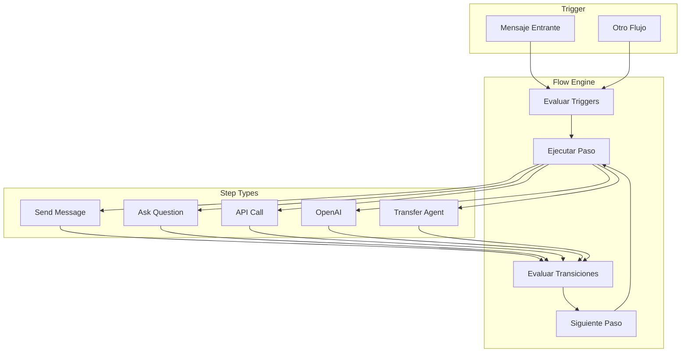

## Resumen

Los flujos permiten automatizar conversaciones de WhatsApp con:

<CardGroup cols={2}>
  <Card title="24 Tipos de Pasos" icon="cubes">
    Mensajes, preguntas, APIs, IA, delays, y más
  </Card>
  <Card title="Condiciones Flexibles" icon="code-branch">
    16 tipos de condiciones para transiciones
  </Card>
  <Card title="Variables Dinámicas" icon="brackets-curly">
    Captura y uso de datos en tiempo real
  </Card>
  <Card title="OpenAI Integration" icon="robot">
    Asistentes de IA conversacional
  </Card>
</CardGroup>

## Arquitectura



## Componentes

### Flow

Contenedor principal del flujo.

```python
class Flow(ConveyModel):
    name = CharField(max_length=200)
    trigger_type = CharField(choices=TriggerType.choices)
    trigger_value = CharField(blank=True)  # Regex o texto exacto
    priority = IntegerField(default=0)
    is_active = BooleanField(default=True)
    whatsapp_lines = ManyToManyField(WhatsAppLine)
```

### Tipos de Trigger

| Tipo | Descripción |
|------|-------------|
| `MESSAGE` | Mensaje que matchea regex/texto |
| `ANY_MESSAGE` | Cualquier mensaje entrante |
| `BY_ANOTHER_FLOW` | Disparado por otro flujo |

### Prioridad

Cuando múltiples flujos podrían activarse, se ejecuta el de mayor prioridad:

```python
flows = Flow.objects.filter(
    whatsapp_lines=line,
    is_active=True,
).order_by('-priority')

for flow in flows:
    if flow.matches_trigger(message):
        execute_flow.delay(flow.id, conversation.id)
        break
```

---

## FlowStep

Paso individual del flujo.

```python
class FlowStep(ConveyModel):
    flow = ForeignKey(Flow, related_name="steps")
    name = CharField(max_length=200)
    step_type = CharField(choices=StepType.choices)
    configuration = JSONField(default=dict)
    is_entry_point = BooleanField(default=False)
    position_x = IntegerField(default=0)  # Para visual builder
    position_y = IntegerField(default=0)
```

<Info>
Cada flujo debe tener exactamente un paso con `is_entry_point=True`.
</Info>

---

## FlowTransition

Conexión entre pasos con condiciones.

```python
class FlowTransition(ConveyModel):
    from_step = ForeignKey(FlowStep, related_name="outgoing")
    to_step = ForeignKey(FlowStep, related_name="incoming")
    condition_type = CharField(choices=ConditionType.choices)
    condition_value = CharField(blank=True)
    priority = IntegerField(default=0)
```

### Evaluación de Transiciones

```python
def evaluate_transitions(step, context):
    transitions = step.outgoing.order_by('-priority')

    for transition in transitions:
        if evaluate_condition(transition, context):
            return transition.to_step

    # Buscar DEFAULT
    default = transitions.filter(condition_type="DEFAULT").first()
    return default.to_step if default else None
```

---

## FlowExecution

Ejecución en runtime.

```python
class FlowExecution(ConveyModel):
    class Status(TextChoices):
        RUNNING = "RUNNING"
        PAUSED = "PAUSED"       # Esperando input
        COMPLETED = "COMPLETED"
        FAILED = "FAILED"
        TIMEOUT = "TIMEOUT"
        CANCELLED = "CANCELLED"

    flow = ForeignKey(Flow)
    conversation = ForeignKey(Conversation)
    current_step = ForeignKey(FlowStep, null=True)
    status = CharField(choices=Status.choices)
    context = JSONField(default=dict)  # Variables capturadas
```

### Context

El context almacena variables durante la ejecución:

```json
{
  "user_name": "Juan",
  "order_id": "12345",
  "api_response": {"status": "success"},
  "last_input": "Sí, confirmo"
}
```

---

## Próximos Pasos

<CardGroup cols={3}>
  <Card title="Tipos de Paso" icon="cubes" href="/flows/step-types">
    Los 24 tipos disponibles
  </Card>
  <Card title="Transiciones" icon="code-branch" href="/flows/transitions">
    Condiciones y lógica
  </Card>
  <Card title="Ejecución" icon="play" href="/flows/execution">
    Motor de flujos
  </Card>
</CardGroup>
