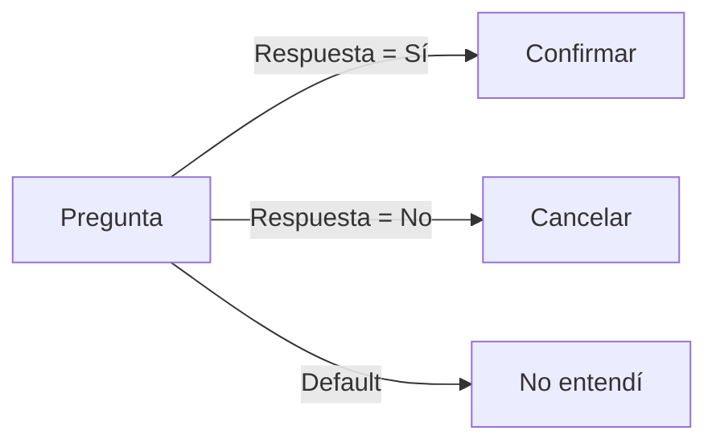
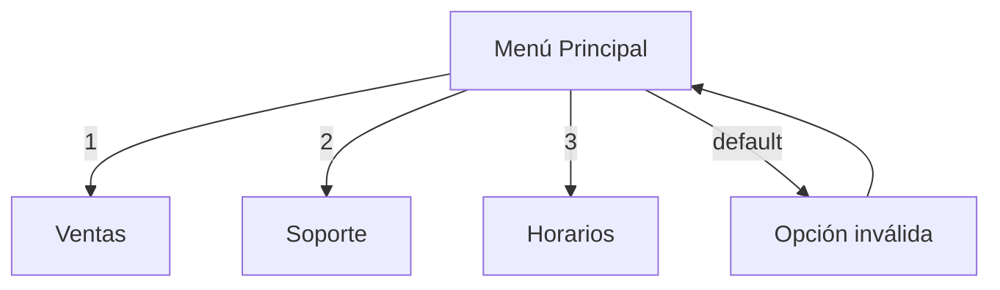
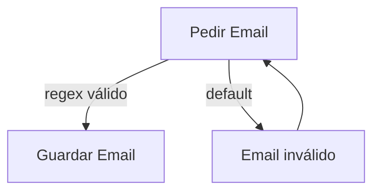
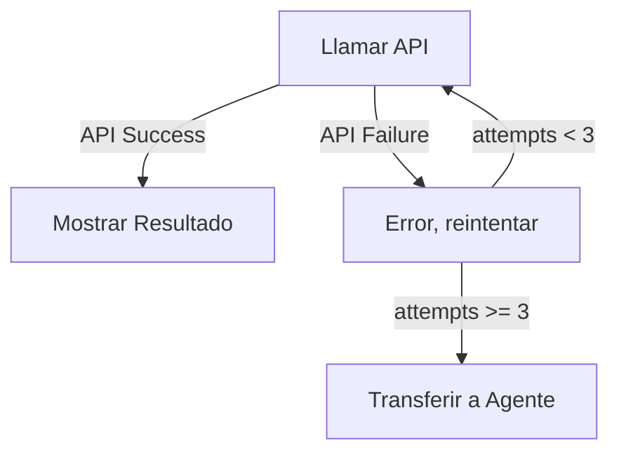

## Overview

Las transiciones conectan pasos y definen la lógica de navegación basada en condiciones.



## Estructura

```python
class FlowTransition(ConveyModel):
    from_step = ForeignKey(FlowStep, related_name="outgoing")
    to_step = ForeignKey(FlowStep, related_name="incoming")
    condition_type = CharField(choices=ConditionType.choices)
    condition_value = CharField(blank=True)
    priority = IntegerField(default=0)
```

## Tipos de Condición

### Siempre

| Tipo | Descripción |
|------|-------------|
| `ALWAYS` | Siempre ejecutar (sin condición) |
| `DEFAULT` | Fallback si ninguna otra condición matchea |

### Comparación de Respuesta

| Tipo | Descripción | Ejemplo |
|------|-------------|---------|
| `EQUALS` | Respuesta igual a valor | `"sí"` |
| `NOT_EQUALS` | Respuesta diferente a valor | `"no"` |
| `CONTAINS` | Respuesta contiene valor | `"ayuda"` |
| `NOT_CONTAINS` | Respuesta no contiene valor | `"cancelar"` |
| `STARTS_WITH` | Respuesta empieza con | `"hola"` |
| `ENDS_WITH` | Respuesta termina con | `"gracias"` |
| `REGEX` | Respuesta matchea regex | `"^\d{10}$"` |

### Comparación de Variables

| Tipo | Descripción | Ejemplo |
|------|-------------|---------|
| `VARIABLE_EQUALS` | Variable igual a valor | `"status:active"` |
| `VARIABLE_NOT_EQUALS` | Variable diferente | `"status:inactive"` |
| `VARIABLE_CONTAINS` | Variable contiene | `"tags:vip"` |
| `VARIABLE_GREATER` | Variable mayor que | `"age:18"` |
| `VARIABLE_LESS` | Variable menor que | `"attempts:3"` |

### Resultado de API

| Tipo | Descripción |
|------|-------------|
| `API_SUCCESS` | API retornó status 2xx |
| `API_FAILURE` | API retornó error |
| `API_STATUS_CODE` | Status code específico |

### Funciones

| Tipo | Descripción | Ejemplo |
|------|-------------|---------|
| `FUNCTION_RESULT` | Resultado de función | `"is_business_hours:true"` |
| `TIMEOUT` | Se agotó el tiempo de espera |

---

## Prioridad

Cuando múltiples transiciones podrían aplicar, se evalúan por prioridad:

```python
transitions = step.outgoing.order_by('-priority')

for transition in transitions:
    if evaluate_condition(transition, context):
        return transition.to_step

# Si ninguna matchea, buscar DEFAULT
default = transitions.filter(condition_type="DEFAULT").first()
return default.to_step if default else None
```

<Info>
Mayor número = mayor prioridad. DEFAULT siempre debe tener la prioridad más baja.
</Info>

---

## Ejemplos

### Menú con Opciones



```python
# Transiciones
FlowTransition(from_step=menu, to_step=ventas, condition_type="EQUALS", condition_value="1", priority=10)
FlowTransition(from_step=menu, to_step=soporte, condition_type="EQUALS", condition_value="2", priority=10)
FlowTransition(from_step=menu, to_step=horarios, condition_type="EQUALS", condition_value="3", priority=10)
FlowTransition(from_step=menu, to_step=invalido, condition_type="DEFAULT", priority=0)
FlowTransition(from_step=invalido, to_step=menu, condition_type="ALWAYS", priority=10)
```

### Validación de Datos



```python
FlowTransition(
    from_step=pedir_email,
    to_step=guardar,
    condition_type="REGEX",
    condition_value=r"^[\w\.-]+@[\w\.-]+\.\w+$",
    priority=10
)
FlowTransition(
    from_step=pedir_email,
    to_step=invalido,
    condition_type="DEFAULT",
    priority=0
)
```

### Resultado de API



```python
FlowTransition(from_step=api_call, to_step=resultado, condition_type="API_SUCCESS", priority=10)
FlowTransition(from_step=api_call, to_step=error, condition_type="API_FAILURE", priority=5)
FlowTransition(from_step=error, to_step=api_call, condition_type="VARIABLE_LESS", condition_value="attempts:3", priority=10)
FlowTransition(from_step=error, to_step=transfer, condition_type="DEFAULT", priority=0)
```

---

## Evaluación de Condiciones

```python
def evaluate_condition(transition, context) -> bool:
    condition_type = transition.condition_type
    condition_value = transition.condition_value
    last_input = context.get("last_input", "")

    if condition_type == "ALWAYS":
        return True

    if condition_type == "EQUALS":
        return last_input.lower() == condition_value.lower()

    if condition_type == "CONTAINS":
        return condition_value.lower() in last_input.lower()

    if condition_type == "REGEX":
        return bool(re.match(condition_value, last_input, re.IGNORECASE))

    if condition_type == "VARIABLE_EQUALS":
        var_name, expected = condition_value.split(":", 1)
        return str(context.get(var_name, "")) == expected

    if condition_type == "API_SUCCESS":
        api_response = context.get("api_response", {})
        status_code = api_response.get("status_code", 0)
        return 200 <= status_code < 300

    if condition_type == "DEFAULT":
        return True  # Fallback

    return False
```
