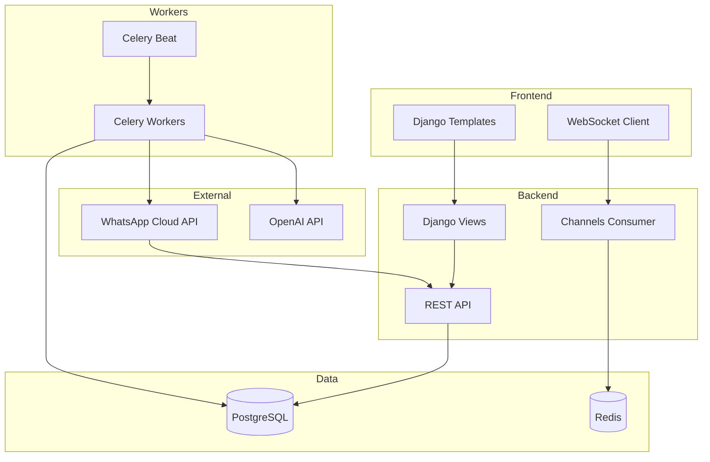

## Bienvenido a Convey Pro

Convey Pro es una plataforma completa de comunicación empresarial para WhatsApp que incluye:

<CardGroup cols={2}>
  <Card
    title="Chat en Tiempo Real"
    icon="comments"
    href="/quickstart"
  >
    Conversaciones con clientes asignadas a agentes humanos con WebSocket en tiempo real
  </Card>
  <Card
    title="Flujos Automatizados"
    icon="diagram-project"
    href="/flows/overview"
  >
    24 tipos de pasos incluyendo IA, APIs, condicionales y transferencias
  </Card>
  <Card
    title="Campañas Masivas"
    icon="bullhorn"
    href="/campaigns/overview"
  >
    Envío masivo con templates HSM, carga de Excel y tracking en tiempo real
  </Card>
  <Card
    title="API REST"
    icon="code"
    href="/api-reference/introduction"
  >
    API completa para integración con sistemas externos
  </Card>
</CardGroup>

## Stack Tecnológico

| Componente | Tecnología |
|------------|------------|
| **Backend** | Django 5.1 + Django REST Framework |
| **Real-time** | Django Channels + Redis |
| **Task Queue** | Celery 5.5 + Redis |
| **Database** | PostgreSQL 15 |
| **Cache** | Redis 6 |
| **Deploy** | Docker + Kubernetes |
| **CDN** | CloudFlare |
| **External API** | WhatsApp Cloud API, OpenAI |

## Arquitectura General



## Apps del Proyecto

<CardGroup cols={3}>
  <Card title="Users" icon="users">
    Usuarios y Agentes de atención
  </Card>
  <Card title="Conversations" icon="message">
    Chat, Contactos, Flujos, Mensajes
  </Card>
  <Card title="Messaging" icon="paper-plane">
    Campañas, Templates, Cola de mensajes
  </Card>
</CardGroup>

## Inicio Rápido

<Steps>
  <Step title="Clonar el repositorio">
    ```bash
    git clone https://github.com/aleducode/conveypro.git
    cd conveypro
    ```
  </Step>
  <Step title="Configurar variables de entorno">
    ```bash
    cp .envs/.local/.django.example .envs/.local/.django
    cp .envs/.local/.postgres.example .envs/.local/.postgres
    ```
  </Step>
  <Step title="Levantar con Docker">
    ```bash
    docker-compose -f local.yml up -d
    ```
  </Step>
  <Step title="Acceder a la aplicación">
    Abrir http://localhost:8000 en el navegador
  </Step>
</Steps>
