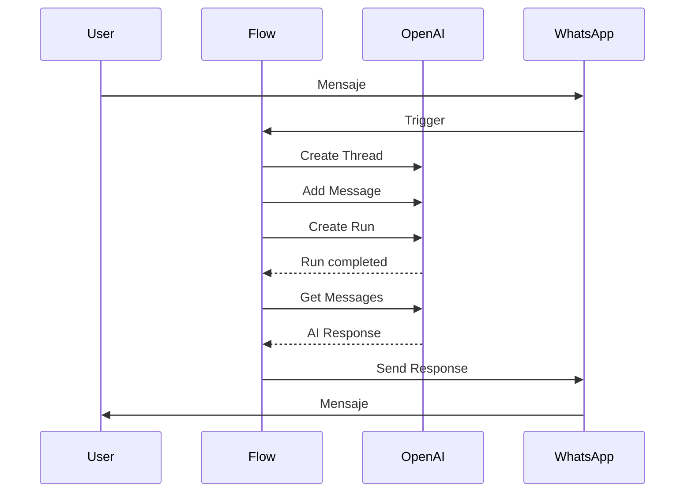

## Overview

Convey Pro integra OpenAI Assistants para crear flujos conversacionales con IA.

## Configuración

### Variables de Entorno

```env
OPENAI_API_KEY=sk-xxx...
```

### Crear Asistente en OpenAI

1. Ir a [OpenAI Platform](https://platform.openai.com/assistants)
2. Crear nuevo asistente
3. Configurar instrucciones y herramientas
4. Copiar el Assistant ID

---

## Uso en Flujos

### Paso OPENAI_ASSISTANT

```json
{
  "step_type": "OPENAI_ASSISTANT",
  "configuration": {
    "assistant_id": "asst_abc123xyz",
    "user_message": "{{last_input}}",
    "response_variable": "ai_response",
    "timeout_seconds": 60
  }
}
```

### Flujo de Ejecución



---

## Implementación

### Task de Celery

```python
@shared_task(
    name="execute_openai_assistant_step",
    queue="openai",  # Cola separada
    max_retries=3,
)
def execute_openai_assistant_step(execution_id: int, step_id: int):
    execution = FlowExecution.objects.get(id=execution_id)
    step = FlowStep.objects.get(id=step_id)
    config = step.configuration

    client = OpenAI(api_key=settings.OPENAI_API_KEY)

    # Obtener o crear thread
    thread_id = execution.context.get("openai_thread_id")
    if not thread_id:
        thread = client.beta.threads.create()
        thread_id = thread.id
        execution.context["openai_thread_id"] = thread_id
        execution.save()

    # Agregar mensaje del usuario
    user_message = render_template(
        config["user_message"],
        execution.context
    )
    client.beta.threads.messages.create(
        thread_id=thread_id,
        role="user",
        content=user_message,
    )

    # Ejecutar asistente
    run = client.beta.threads.runs.create(
        thread_id=thread_id,
        assistant_id=config["assistant_id"],
    )

    # Esperar resultado (polling)
    while run.status in ["queued", "in_progress"]:
        time.sleep(1)
        run = client.beta.threads.runs.retrieve(
            thread_id=thread_id,
            run_id=run.id,
        )

    if run.status != "completed":
        raise Exception(f"OpenAI run failed: {run.status}")

    # Obtener respuesta
    messages = client.beta.threads.messages.list(thread_id=thread_id)
    ai_response = messages.data[0].content[0].text.value

    # Guardar en contexto
    response_var = config.get("response_variable", "ai_response")
    execution.context[response_var] = ai_response
    execution.save()

    # Enviar respuesta a WhatsApp
    send_whatsapp_message(execution.conversation, ai_response)

    # Continuar flujo
    next_step = evaluate_transitions(step, execution.context)
    if next_step:
        execute_flow_step.delay(execution.id, next_step.id)
```

---

## Function Calling

OpenAI puede llamar funciones definidas:

### Definir Funciones

```python
tools = [
    {
        "type": "function",
        "function": {
            "name": "get_order_status",
            "description": "Obtiene el estado de un pedido",
            "parameters": {
                "type": "object",
                "properties": {
                    "order_id": {
                        "type": "string",
                        "description": "ID del pedido"
                    }
                },
                "required": ["order_id"]
            }
        }
    }
]
```

### Manejar Tool Calls

```python
if run.status == "requires_action":
    tool_calls = run.required_action.submit_tool_outputs.tool_calls

    outputs = []
    for tool_call in tool_calls:
        if tool_call.function.name == "get_order_status":
            args = json.loads(tool_call.function.arguments)
            result = get_order_status(args["order_id"])
            outputs.append({
                "tool_call_id": tool_call.id,
                "output": json.dumps(result),
            })

    client.beta.threads.runs.submit_tool_outputs(
        thread_id=thread_id,
        run_id=run.id,
        tool_outputs=outputs,
    )
```

---

## Caching

Para optimizar costos, se cachean respuestas similares:

```python
from django.core.cache import cache

def get_cached_response(assistant_id: str, message: str) -> str | None:
    cache_key = f"openai:{assistant_id}:{hash(message)}"
    return cache.get(cache_key)

def cache_response(assistant_id: str, message: str, response: str):
    cache_key = f"openai:{assistant_id}:{hash(message)}"
    cache.set(cache_key, response, timeout=3600)  # 1 hora
```

---

## Rate Limiting

Cola separada para evitar bloquear otros tasks:

```python
# config/celery_app.py
task_routes = {
    "execute_openai_assistant_step": {"queue": "openai"},
    "process_with_openai_assistant": {"queue": "openai"},
}
```

```yaml
# local.yml
celeryworker-openai:
  command: celery -A config.celery_app worker -Q openai -c 2
```

---

## Costos

| Modelo | Input | Output |
|--------|-------|--------|
| GPT-4o | $5/1M tokens | $15/1M tokens |
| GPT-4o-mini | $0.15/1M tokens | $0.60/1M tokens |

<Tip>
Usa GPT-4o-mini para tareas simples y reduce costos hasta 30x.
</Tip>
