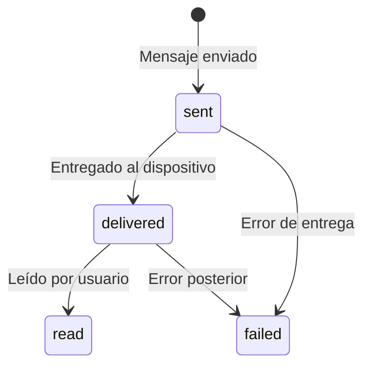

## Endpoint

**URL:** `POST /api/webhook/`

**Archivo:** `convey/conversations/api/webhook.py`

## Verificación

Meta requiere verificar el webhook con un challenge:

```python
def webhook_verify(request):
    mode = request.GET.get("hub.mode")
    token = request.GET.get("hub.verify_token")
    challenge = request.GET.get("hub.challenge")

    if mode == "subscribe" and token == settings.WHATSAPP_VERIFY_TOKEN:
        return HttpResponse(challenge, status=200)
    return HttpResponse("Forbidden", status=403)
```

## Tipos de Eventos

### Mensaje Entrante

```json
{
  "object": "whatsapp_business_account",
  "entry": [{
    "id": "WABA_ID",
    "changes": [{
      "value": {
        "messaging_product": "whatsapp",
        "metadata": {
          "display_phone_number": "15551234567",
          "phone_number_id": "PHONE_NUMBER_ID"
        },
        "messages": [{
          "id": "wamid.xxx",
          "from": "521234567890",
          "timestamp": "1234567890",
          "type": "text",
          "text": {"body": "Hola!"}
        }]
      }
    }]
  }]
}
```

### Status Update

```json
{
  "entry": [{
    "changes": [{
      "value": {
        "statuses": [{
          "id": "wamid.xxx",
          "status": "delivered",
          "timestamp": "1234567890",
          "recipient_id": "521234567890"
        }]
      }
    }]
  }]
}
```

### Status con Error

```json
{
  "statuses": [{
    "id": "wamid.xxx",
    "status": "failed",
    "timestamp": "1234567890",
    "errors": [{
      "code": 131049,
      "title": "Message not delivered",
      "message": "Spam protection triggered"
    }]
  }]
}
```

---

## Procesamiento

### Mensaje Entrante

```python
def process_incoming_message(webhook_data: dict):
    message_data = webhook_data["messages"][0]
    metadata = webhook_data["metadata"]

    # Encontrar línea
    line = WhatsAppLine.objects.get(
        phone_number_id=metadata["phone_number_id"]
    )

    # Obtener o crear contacto
    contact, _ = Contact.objects.get_or_create(
        phone_number=f"+{message_data['from']}"
    )

    # Obtener o crear conversación
    conversation, _ = Conversation.objects.get_or_create(
        contact=contact,
        whatsapp_line=line,
    )

    # Crear mensaje
    message = Message.objects.create(
        conversation=conversation,
        message_type="INCOMING",
        content_type=message_data["type"].upper(),
        content=extract_content(message_data),
        whatsapp_message_id=message_data["id"],
        timestamp=parse_timestamp(message_data["timestamp"]),
    )

    # Trigger flows
    trigger_flows_for_message.delay(message.id)

    # Broadcast WebSocket
    broadcast_message(conversation.id, message)

    return message
```

### Status Update

```python
def process_status_update(status_data: dict):
    wam_id = status_data["id"]
    new_status = status_data["status"].upper()
    timestamp = parse_timestamp(status_data["timestamp"])

    # Buscar mensaje
    try:
        message = Message.objects.get(whatsapp_message_id=wam_id)
    except Message.DoesNotExist:
        logger.warning(f"Message not found: {wam_id}")
        return

    # Actualizar status
    message.status = new_status
    message.save()

    # Crear historial
    MessageStatusHistory.objects.create(
        message=message,
        status=new_status,
        timestamp=timestamp,
        raw_webhook=status_data,
    )

    # Actualizar QueuedMessage si existe
    if hasattr(message, 'queued_source'):
        qm = message.queued_source
        qm.delivery_status = new_status
        qm.save()

        if qm.campaign:
            update_campaign_stats.delay(qm.campaign.id)
```

---

## Flujo de Status



---

## Códigos de Error

| Código | Título | Descripción |
|--------|--------|-------------|
| 131049 | Spam Protection | Mensaje bloqueado por protección de spam |
| 131047 | Re-engagement Required | Fuera de ventana de 24h |
| 131026 | Message Undeliverable | Número inválido o bloqueado |
| 131051 | Unsupported Message Type | Tipo de mensaje no soportado |
| 130472 | User Blocked | Usuario bloqueó el número |

---

## Seguridad

### Validar Firma

```python
def validate_webhook_signature(request) -> bool:
    signature = request.headers.get("X-Hub-Signature-256")
    if not signature:
        return False

    expected = hmac.new(
        settings.WHATSAPP_APP_SECRET.encode(),
        request.body,
        hashlib.sha256,
    ).hexdigest()

    return hmac.compare_digest(f"sha256={expected}", signature)
```

### Rate Limiting

```python
# Límite de webhooks por IP
from django_ratelimit.decorators import ratelimit

@ratelimit(key='ip', rate='100/m')
def webhook_view(request):
    ...
```

---

## Debugging

### Ver webhooks recibidos

```python
# En Django shell
from convey.conversations.models import MessageStatusHistory

# Últimos 10 webhooks
for h in MessageStatusHistory.objects.order_by('-created')[:10]:
    print(f"{h.status} - {h.timestamp}")
    print(h.raw_webhook)
```

### Logs

```bash
# Ver logs de webhook
docker-compose -f local.yml logs -f django | grep webhook
```
