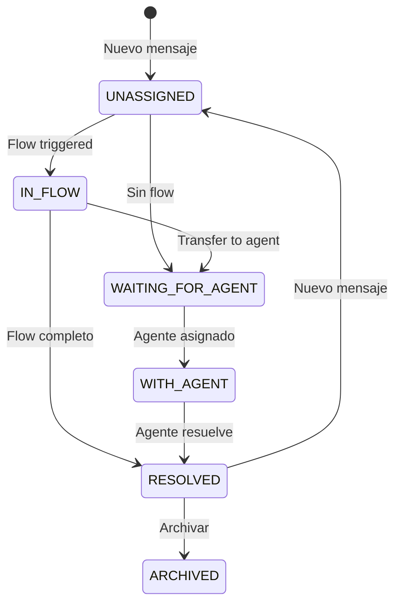

## WhatsAppLine

Configuración de una línea de WhatsApp Business.

```python
class WhatsAppLine(ConveyModel):
    name = CharField(max_length=200)
    phone_number = CharField(max_length=20)
    phone_number_id = CharField(max_length=50)
    waba_id = CharField(max_length=50)
    access_token = TextField()
    is_active = BooleanField(default=True)
```

| Campo | Descripción |
|-------|-------------|
| `phone_number_id` | ID del número en Meta |
| `waba_id` | WhatsApp Business Account ID |
| `access_token` | Token de acceso a Graph API |

---

## Contact

Contacto de WhatsApp.

```python
class Contact(ConveyModel):
    phone_number = CharField(max_length=20, unique=True)
    name = CharField(max_length=200, blank=True)
    email = EmailField(blank=True, null=True, unique=True)
    country_code = CharField(max_length=5, blank=True)
    language = CharField(choices=Language.choices, default="ES")
    last_seen = DateTimeField(null=True)
    time_window = DateTimeField(null=True)
```

<Info>
`time_window` indica hasta cuándo se pueden enviar mensajes gratis (ventana de 24h de WhatsApp).
</Info>

---

## Conversation

Hilo de conversación entre un contacto y una línea.

```python
class Conversation(ConveyModel):
    class Status(TextChoices):
        UNASSIGNED = "UNASSIGNED"
        IN_FLOW = "IN_FLOW"
        WAITING_FOR_AGENT = "WAITING_FOR_AGENT"
        WITH_AGENT = "WITH_AGENT"
        RESOLVED = "RESOLVED"
        ARCHIVED = "ARCHIVED"

    contact = ForeignKey(Contact)
    whatsapp_line = ForeignKey(WhatsAppLine)
    conversation_status = CharField(choices=Status.choices)
    assigned_agent = ForeignKey(Agent, null=True)
    unread_count = IntegerField(default=0)
    last_message = ForeignKey(Message, null=True)
```

### Diagrama de Estados



---

## Message

Mensaje individual en una conversación.

```python
class Message(ConveyModel):
    class MessageType(TextChoices):
        INCOMING = "INCOMING"
        OUTGOING = "OUTGOING"
        SYSTEM = "SYSTEM"

    class ContentType(TextChoices):
        TEXT = "TEXT"
        IMAGE = "IMAGE"
        VIDEO = "VIDEO"
        AUDIO = "AUDIO"
        DOCUMENT = "DOCUMENT"
        LOCATION = "LOCATION"
        STICKER = "STICKER"
        INTERACTIVE = "INTERACTIVE"

    conversation = ForeignKey(Conversation)
    message_type = CharField(choices=MessageType.choices)
    content_type = CharField(choices=ContentType.choices)
    content = TextField()
    whatsapp_message_id = CharField(max_length=100, db_index=True)
    status = CharField()  # SENT, DELIVERED, READ, FAILED
    timestamp = DateTimeField()
    replied_to = ForeignKey('self', null=True)
```

---

## MessageStatusHistory

Historial de status de un mensaje (webhooks recibidos).

```python
class MessageStatusHistory(ConveyModel):
    class Status(TextChoices):
        SENT = "SENT"
        DELIVERED = "DELIVERED"
        READ = "READ"
        FAILED = "FAILED"

    message = ForeignKey(Message, related_name="status_history")
    status = CharField(choices=Status.choices)
    timestamp = DateTimeField()  # Timestamp del webhook
    raw_webhook = JSONField()    # Payload completo
```

<Warning>
El `timestamp` es el reportado por WhatsApp, no el momento de recepción del webhook.
</Warning>

---

## Flow

Flujo automatizado de conversación.

```python
class Flow(ConveyModel):
    class TriggerType(TextChoices):
        MESSAGE = "MESSAGE"         # Mensaje específico
        ANY_MESSAGE = "ANY_MESSAGE" # Cualquier mensaje
        BY_ANOTHER_FLOW = "BY_ANOTHER_FLOW"

    name = CharField(max_length=200)
    trigger_type = CharField(choices=TriggerType.choices)
    trigger_value = CharField(blank=True)  # Regex o texto
    priority = IntegerField(default=0)
    is_active = BooleanField(default=True)
    whatsapp_lines = ManyToManyField(WhatsAppLine)
```

---

## FlowStep

Paso individual de un flujo.

```python
class FlowStep(ConveyModel):
    flow = ForeignKey(Flow, related_name="steps")
    name = CharField(max_length=200)
    step_type = CharField(choices=StepType.choices)
    configuration = JSONField(default=dict)
    is_entry_point = BooleanField(default=False)
    position_x = IntegerField(default=0)
    position_y = IntegerField(default=0)
```

### Tipos de Paso (24 tipos)

| Tipo | Descripción |
|------|-------------|
| `SEND_MESSAGE` | Enviar mensaje de texto |
| `ASK_QUESTION` | Preguntar y esperar respuesta |
| `API_CALL` | Llamada a API externa |
| `OPENAI_ASSISTANT` | Integración OpenAI |
| `DELAY` | Esperar X segundos |
| `SET_VARIABLE` | Guardar variable |
| `CONDITIONAL` | Condicional IF/ELSE |
| `TRANSFER_TO_AGENT` | Transferir a humano |
| `TEXT_TO_SPEECH` | Texto a audio |
| `AUDIO_TO_TEXT` | Audio a texto |
| ... | Y más |

---

## FlowTransition

Transición entre pasos con condiciones.

```python
class FlowTransition(ConveyModel):
    from_step = ForeignKey(FlowStep, related_name="outgoing")
    to_step = ForeignKey(FlowStep, related_name="incoming")
    condition_type = CharField(choices=ConditionType.choices)
    condition_value = CharField(blank=True)
    priority = IntegerField(default=0)
```

### Tipos de Condición

| Tipo | Descripción |
|------|-------------|
| `ALWAYS` | Siempre ejecutar |
| `EQUALS` | Respuesta igual a valor |
| `CONTAINS` | Respuesta contiene valor |
| `REGEX` | Respuesta matchea regex |
| `VARIABLE_EQUALS` | Variable igual a valor |
| `API_SUCCESS` | API retornó éxito |
| `API_FAILURE` | API falló |
| `DEFAULT` | Fallback si nada matchea |

---

## FlowExecution

Ejecución en runtime de un flujo.

```python
class FlowExecution(ConveyModel):
    class Status(TextChoices):
        RUNNING = "RUNNING"
        PAUSED = "PAUSED"
        COMPLETED = "COMPLETED"
        FAILED = "FAILED"
        TIMEOUT = "TIMEOUT"
        CANCELLED = "CANCELLED"

    flow = ForeignKey(Flow)
    conversation = ForeignKey(Conversation)
    current_step = ForeignKey(FlowStep, null=True)
    status = CharField(choices=Status.choices)
    context = JSONField(default=dict)  # Variables del flujo
    triggered_by_message = ForeignKey(Message, null=True)
```

<Info>
`context` almacena todas las variables capturadas durante la ejecución del flujo.
</Info>
