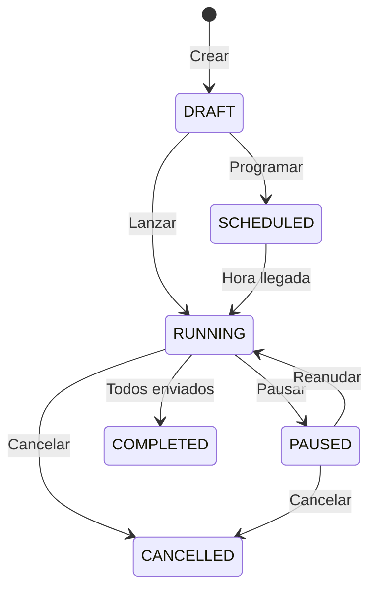

## MessageTemplate

Template HSM sincronizado desde Meta.

```python
class MessageTemplate(ConveyModel):
    class Status(TextChoices):
        APPROVED = "APPROVED"
        PENDING = "PENDING"
        REJECTED = "REJECTED"

    class Category(TextChoices):
        MARKETING = "MARKETING"
        UTILITY = "UTILITY"
        AUTHENTICATION = "AUTHENTICATION"
        SERVICE = "SERVICE"

    whatsapp_line = ForeignKey(WhatsAppLine)
    template_id = CharField(max_length=50)  # ID en Meta
    name = CharField(max_length=512)
    language = CharField(max_length=10, default="es")
    category = CharField(choices=Category.choices)
    status = CharField(choices=Status.choices)
    components = JSONField(default=list)
    last_synced = DateTimeField(null=True)
```

### Estructura de Components

```json
[
  {
    "type": "HEADER",
    "format": "IMAGE"
  },
  {
    "type": "BODY",
    "text": "Hola {{1}}, tu pedido {{2}} está listo."
  },
  {
    "type": "FOOTER",
    "text": "Gracias por tu compra"
  },
  {
    "type": "BUTTONS",
    "buttons": [
      {"type": "URL", "text": "Ver pedido", "url": "https://..."}
    ]
  }
]
```

### Métodos

```python
def get_price_for_country(self, country_code: str) -> Decimal:
    """Obtiene precio del template para un país."""
    try:
        pricing = WhatsAppPricing.objects.get(
            country_code=country_code,
            category=self.category
        )
        return pricing.price
    except WhatsAppPricing.DoesNotExist:
        return DEFAULT_PRICING[self.category]

def get_variables(self) -> list[str]:
    """Extrae variables del template ({{1}}, {{2}}, etc.)"""
    import re
    variables = []
    for comp in self.components:
        if "text" in comp:
            found = re.findall(r'\{\{(\d+)\}\}', comp["text"])
            variables.extend(found)
    return sorted(set(variables))
```

---

## OutboundCampaign

Campaña de mensajería masiva.

```python
class OutboundCampaign(ConveyModel):
    class Status(TextChoices):
        DRAFT = "DRAFT"
        SCHEDULED = "SCHEDULED"
        RUNNING = "RUNNING"
        PAUSED = "PAUSED"
        COMPLETED = "COMPLETED"
        CANCELLED = "CANCELLED"

    name = CharField(max_length=200)
    description = TextField(blank=True)
    whatsapp_line = ForeignKey(WhatsAppLine)
    template = ForeignKey(MessageTemplate, null=True)
    header_image_url = URLField(blank=True)

    # Configuración
    status = CharField(choices=Status.choices, default=Status.DRAFT)
    messages_per_minute = IntegerField(default=60)
    scheduled_at = DateTimeField(null=True)

    # Estadísticas (denormalizadas)
    total_recipients = IntegerField(default=0)
    messages_sent = IntegerField(default=0)
    messages_delivered = IntegerField(default=0)
    messages_read = IntegerField(default=0)
    messages_failed = IntegerField(default=0)

    # Costos
    estimated_cost = DecimalField(max_digits=10, decimal_places=4, default=0)
    actual_cost = DecimalField(max_digits=10, decimal_places=4, default=0)

    # Timestamps
    started_at = DateTimeField(null=True)
    completed_at = DateTimeField(null=True)
    created_by = ForeignKey(User)
```

### Diagrama de Estados



---

## CampaignRecipient

Destinatario individual de una campaña.

```python
class CampaignRecipient(ConveyModel):
    class Status(TextChoices):
        PENDING = "PENDING"
        QUEUED = "QUEUED"
        SENT = "SENT"
        DELIVERED = "DELIVERED"
        READ = "READ"
        FAILED = "FAILED"

    campaign = ForeignKey(OutboundCampaign, related_name="recipients")
    contact = ForeignKey(Contact)
    template_variables = JSONField(default=dict)
    status = CharField(choices=Status.choices, default=Status.PENDING)
    error_message = TextField(blank=True)
    queued_message = OneToOneField(QueuedMessage, null=True)
```

### Ejemplo de template_variables

```json
{
  "1": "Juan Pérez",
  "2": "ORD-12345",
  "3": "15 de diciembre"
}
```

---

## QueuedMessage

Mensaje en cola para envío.

```python
class QueuedMessage(ConveyModel):
    class Status(TextChoices):
        PENDING = "PENDING"
        SCHEDULED = "SCHEDULED"
        PROCESSING = "PROCESSING"
        SENT = "SENT"
        FAILED = "FAILED"
        CANCELLED = "CANCELLED"

    class SendMethod(TextChoices):
        TEMPLATE = "TEMPLATE"    # HSM con costo
        SIMULATED = "SIMULATED"  # Dentro de 24h (gratis)
        NORMAL = "NORMAL"
        INTERACTIVE = "INTERACTIVE"

    # Target
    contact = ForeignKey(Contact)
    conversation = ForeignKey(Conversation, null=True)
    whatsapp_line = ForeignKey(WhatsAppLine)

    # Content
    template = ForeignKey(MessageTemplate, null=True)
    template_variables = JSONField(default=dict)

    # Campaign
    campaign = ForeignKey(OutboundCampaign, null=True)

    # Status
    status = CharField(choices=Status.choices)
    send_method = CharField(choices=SendMethod.choices, blank=True)
    delivery_status = CharField(blank=True)  # SENT, DELIVERED, READ, FAILED

    # Tracking
    whatsapp_message_id = CharField(max_length=100, blank=True)
    message = OneToOneField(Message, null=True)  # Link al Message creado

    # Retry logic
    attempts = IntegerField(default=0)
    max_attempts = IntegerField(default=3)
    error_message = TextField(blank=True)

    # Cost
    estimated_cost = DecimalField(default=0)
    actual_cost = DecimalField(default=0)

    # API debugging
    api_request = JSONField(default=dict)
    api_response = JSONField(default=dict)
```

<Warning>
El campo `message` vincula al `Message` creado en conversations. Es importante para el tracking de status history.
</Warning>

---

## WhatsAppPricing

Precios por país y categoría.

```python
class WhatsAppPricing(ConveyModel):
    country_code = CharField(max_length=5)  # MX, CO, AR
    category = CharField(choices=MessageTemplate.Category.choices)
    price = DecimalField(max_digits=6, decimal_places=4)

    class Meta:
        unique_together = ["country_code", "category"]
```

### Precios Default

```python
DEFAULT_PRICING = {
    "MARKETING": Decimal("0.0604"),
    "UTILITY": Decimal("0.0077"),
    "AUTHENTICATION": Decimal("0.0077"),
    "SERVICE": Decimal("0.0000"),
}
```

---

## Queries Comunes

```python
# Estadísticas de campaña
from django.db.models import Count, Q

stats = campaign.queued_messages.aggregate(
    total=Count("id"),
    sent=Count("id", filter=Q(status="SENT")),
    failed=Count("id", filter=Q(status="FAILED")),
    delivered=Count("id", filter=Q(delivery_status="DELIVERED")),
    read=Count("id", filter=Q(delivery_status="READ")),
)

# Templates aprobados de una línea
templates = MessageTemplate.objects.filter(
    whatsapp_line=line,
    status="APPROVED"
).order_by("-last_synced")

# Mensajes pendientes en cola
pending = QueuedMessage.objects.filter(
    status__in=["PENDING", "SCHEDULED"],
    campaign__status="RUNNING"
).order_by("priority", "created")
```
