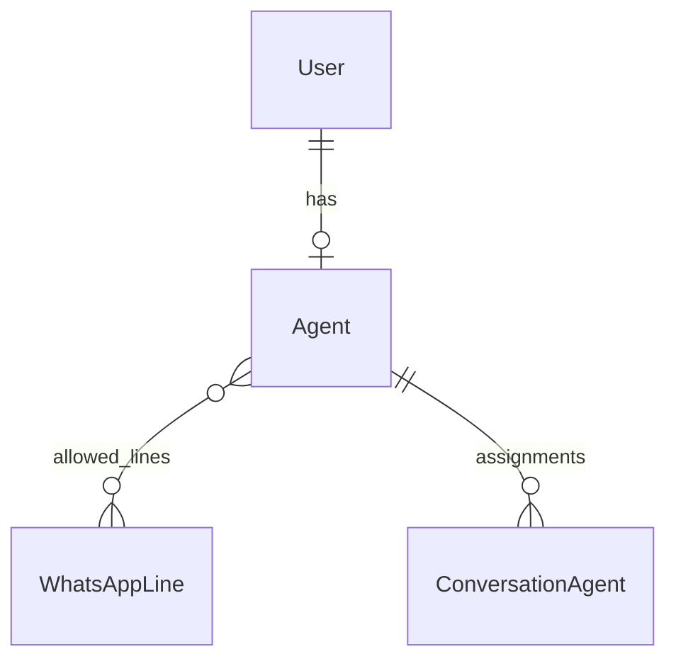

## User

Usuario del sistema con autenticación basada en email.

```python
class User(AbstractUser):
    """Custom user model with email-based authentication."""

    username = None  # Removido
    email = EmailField(unique=True)
    name = CharField(max_length=255, blank=True)

    USERNAME_FIELD = "email"
    REQUIRED_FIELDS = []
```

### Campos

| Campo | Tipo | Descripción |
|-------|------|-------------|
| `id` | AutoField | Primary key |
| `email` | EmailField | Email único (login) |
| `name` | CharField | Nombre completo |
| `is_active` | BooleanField | Usuario activo |
| `is_staff` | BooleanField | Acceso al admin |
| `date_joined` | DateTimeField | Fecha de registro |

---

## Agent

Perfil de agente de atención al cliente.

```python
class Agent(ConveyModel):
    """Customer service agent profile."""

    user = OneToOneField(User, on_delete=CASCADE, related_name="agent")
    in_service = BooleanField(default=False)
    current_chats_number = IntegerField(default=0)
    allowed_lines = ManyToManyField(WhatsAppLine, blank=True)
```

### Campos

| Campo | Tipo | Descripción |
|-------|------|-------------|
| `user` | OneToOneField | Relación con User |
| `in_service` | BooleanField | Disponible para chats |
| `current_chats_number` | IntegerField | Chats activos actuales |
| `allowed_lines` | ManyToManyField | Líneas permitidas (vacío = todas) |

### Métodos

```python
@property
def can_receive_chats(self) -> bool:
    """Check if agent can receive new chats."""
    max_chats = SystemConfiguration.get_max_chats_per_agent()
    return self.in_service and self.current_chats_number < max_chats

def assign_conversation(self, conversation):
    """Assign a conversation to this agent."""
    conversation.assigned_agent = self
    conversation.conversation_status = "WITH_AGENT"
    conversation.save()
    self.current_chats_number += 1
    self.save()
```

### Relaciones



## Queries Comunes

```python
# Agentes disponibles
available_agents = Agent.objects.filter(
    in_service=True,
    current_chats_number__lt=F('max_chats')
)

# Agentes de una línea específica
line_agents = Agent.objects.filter(
    Q(allowed_lines=line) | Q(allowed_lines__isnull=True)
)

# Usuario con su agente
user = User.objects.select_related('agent').get(email='agent@example.com')
```
